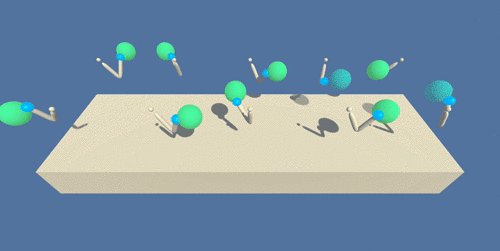

Continuous Control project using a DDPG algorithm in Reinforcement Learning

# Udacity Deep Reinforcement Learning Nanodegree
## Project 2 - Continuous-Control-DDPG

This is the second project for the Udacity Deep Reinforcement Learning Nanodegree. The goal is to implement model based on [Deep Deterministic Policy Gradient (DDPG)](https://arxiv.org/abs/1509.02971) to control the movement of a group of 20 identical double-jointed robotic arms in a Unity ML-Agents environment [Reacher](https://github.com/Unity-Technologies/ml-agents/blob/master/docs/Learning-Environment-Examples.md#reacher). 




## Environment description

In this environment, a double-jointed arm can move to target locations. A reward of +0.1 is provided for each step that the agent's hand is in the goal location. Thus, the goal of your agent is to maintain its position at the target location for as many time steps as possible.

The observation space (for each agent) consists of 33 variables corresponding to position, rotation, velocity, and angular velocities of the arm. Each action is a vector with four numbers, corresponding to torque applicable to two joints. Every entry in the action vector should be a number between -1 and 1.


## Task description

For successfully solving the environment, the agents must get an average score of +30 (over 100 consecutive episodes, and over all agents).  Specifically,
- After each episode, we add up the rewards that each agent received (without discounting), to get a score for each agent.  This yields 20 (potentially different) scores.  We then take the average of these 20 scores. 
- This yields an **average score** for each episode (where the average is over all 20 agents).

The environment is considered solved, when the average (over 100 episodes) of those average scores is at least +30. 


## Dependencies Installation and Usage Guide

1. Prepare new Conda environment (with python 3.6) following guidelines on [Udacity DRL repo](https://github.com/udacity/deep-reinforcement-learning#dependencies) 


2. Install the `unityagents` package with:

```sh
pip install unityagents==0.4.0
```

### Getting Started

3. Download the environment from one of the links below.  You need only select the environment that matches your operating system:

      - Linux: [click here](https://s3-us-west-1.amazonaws.com/udacity-drlnd/P2/Reacher/Reacher_Linux.zip)
      - Mac OSX: [click here](https://s3-us-west-1.amazonaws.com/udacity-drlnd/P2/Reacher/Reacher.app.zip)
      - Windows (32-bit): [click here](https://s3-us-west-1.amazonaws.com/udacity-drlnd/P2/Reacher/Reacher_Windows_x86.zip)
      - Windows (64-bit): [click here](https://s3-us-west-1.amazonaws.com/udacity-drlnd/P2/Reacher/Reacher_Windows_x86_64.zip)
    

4. Place the downloaded zip file in the root directory of this repository and unzip it.

5. Path to the executable file has to be provided to `UnityEnvironment` function in `NContinuous_Control.ipynb` 

      For example on 64-bit Windows:
      ```python
      env = UnityEnvironment(file_name='./Reacher_Windows_x86_64/Reacher.exe')
      ```

4. Run the `NContinuous_Control.ipynb` notebook to either train the DDPG agent from scratch or use the already trained model weights in the files `checkpoint_actor.pth` and `checkpoint_critic.pth`.

5. Watch a smart agent playing!
